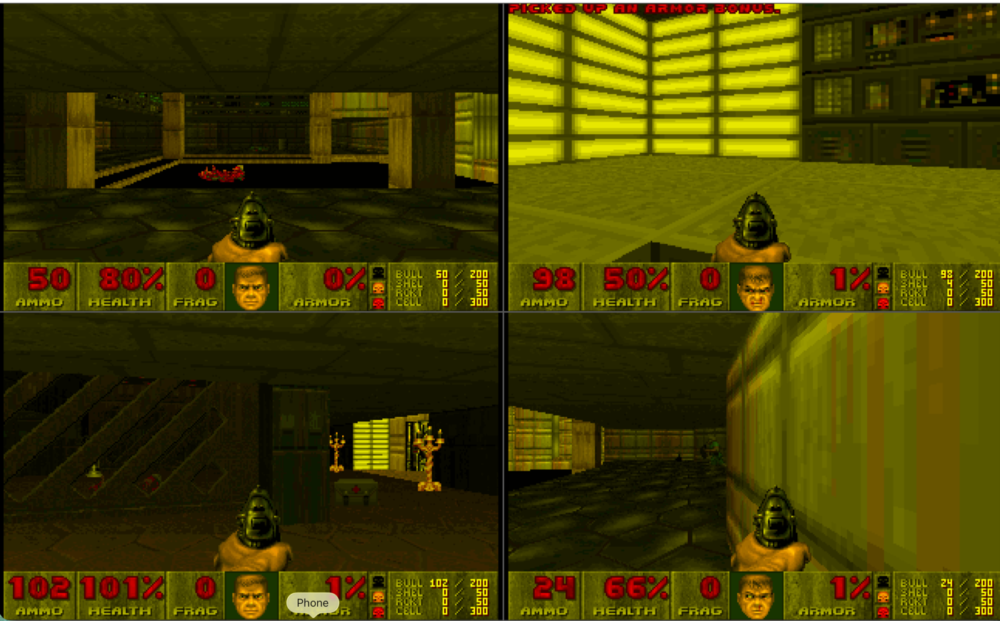

# CouchDoom

Four-player local **split-screen Doom deathmatch**. CouchDoom runs four full
Doom instances side by side — as if on four networked PCs — and fake-networks
them into one couch multiplayer match. Grab some gamepads and frag your friends;
any empty seat is filled by an AI bot.



- 2×2 split screen, one Doom instance per player, in perfect lockstep.
- Up to 4 humans on gamepads; player 1 can also use the keyboard.
- Empty slots are played by bots, so you can go 1-v-3 against the AI.
- Deathmatch, Altdeath, or Co-op on any Episode 1 map, with skill, monsters,
  and frag-limit options.
- The shareware **DOOM1.WAD** is bundled — nothing else to download.

## Build

CouchDoom builds with CMake using the toolchain presets from the `gin`
submodule. First clone with submodules:

```sh
git clone --recursive <repo-url> CouchDoom
cd CouchDoom
# already cloned without --recursive?
git submodule update --init --recursive
```

Then configure and build for your platform:

| Platform | Configure            | Build                                                      |
| -------- | -------------------- | --------------------------------------------------------- |
| macOS    | `cmake --preset xcode`     | `cmake --build --preset xcode --config Release --target CouchDoom` |
| Linux    | `cmake --preset ninja-gcc` | `cmake --build --preset ninja-gcc --config Release --target CouchDoom` |
| Windows  | `cmake --preset vs`        | `cmake --build --preset vs --config Release --target CouchDoom` |

The app lands in `Builds/<preset>/CouchDoom_artefacts/Release/` (`CouchDoom.app`
on macOS, `CouchDoom` on Linux, `CouchDoom.exe` on Windows). Drop `--config
Release` (or use `Debug`) for a debug build.

## Playing

### The lobby

On launch you land in the **match setup** lobby. A 2×2 grid shows each seat:
plug in a controller and its slot lights up as a player (**P1–P4**); any seat
left empty shows **AI** and is played by a bot. Player 1 always works from the
keyboard even with no controller attached.

Adjust the match from the menu on the right:

| Setting        | Options                                             |
| -------------- | --------------------------------------------------- |
| **Mode**       | Deathmatch · Altdeath · Co-op                       |
| **Map**        | E1M1 – E1M9                                          |
| **Skill**      | I'm Too Young To Die … Nightmare                     |
| **Monsters**   | On / Off                                             |
| **Frag Limit** | Off, or first to N frags ends the match             |
| **Volume**     | Master output level                                 |

Navigate with **D-pad / arrow keys**, change a value with **A / Enter**, and
press **START** (button or the START menu row) to begin. Your settings are
remembered between runs.

When a match ends (frag limit reached), the frag table is shown and then you
drop back to the lobby for the next round.

### Controls — gamepad

| Action            | Button                                    |
| ----------------- | ----------------------------------------- |
| Move / strafe     | Left stick (also D-pad up/down = forward) |
| Turn              | Right stick (also D-pad left/right)       |
| Fire              | Right trigger **or** X                     |
| Use / open door   | A                                          |
| Run (hold)        | Left trigger                              |
| Automap           | Y                                          |
| Next / prev weapon| Right bumper / Left bumper                |
| Menu (in-game)    | START                                      |

### Controls — keyboard (player 1)

| Action          | Key                          |
| --------------- | ---------------------------- |
| Forward / back  | `W` / `S` (or ↑ / ↓)         |
| Strafe          | `A` / `D`                    |
| Turn            | ← / →                        |
| Fire            | `Space`                      |
| Use / open door | `E`                          |
| Run (hold)      | `Shift`                      |
| Weapons         | `1`–`7`                      |
| Menu            | `Esc` (select `Enter`, back `Backspace`, `Y`/`N`) |

## How it works

Each player is an independent Doom simulation running on its own thread. Instead
of real network sockets, a local arbiter swaps every player's input each tic and
feeds the identical set of commands to all four instances, keeping them in exact
lockstep — Doom's own peer-to-peer deathmatch model with the network replaced by
a function call. This is possible because the underlying
[`Gin_Doom`](modules/Gin_Doom) engine has been de-globalized so each instance
carries its own state (`data_t`) rather than sharing one set of globals.

## Project layout

```
CouchDoom/
├── CMakeLists.txt          # juce_add_gui_app; gin + gin_doom modules
├── CMakePresets.json       # toolchains from the gin submodule
├── Assets/DOOM1.WAD        # shareware IWAD, baked into the app
├── docs/                   # screenshot and docs
├── modules/                # submodules: juce, gin, Gin_Doom
└── Source/
    ├── Main.cpp            # JUCEApplication bootstrap
    ├── MainComponent.*     # 60 Hz driver; owns the subsystems below
    ├── game/               # DoomHost (the four instances) + match config
    ├── audio/              # SoundEngine (device manager + 4-engine mixer)
    ├── input/              # controller + keyboard routing
    └── view/               # lobby / title screen
```
